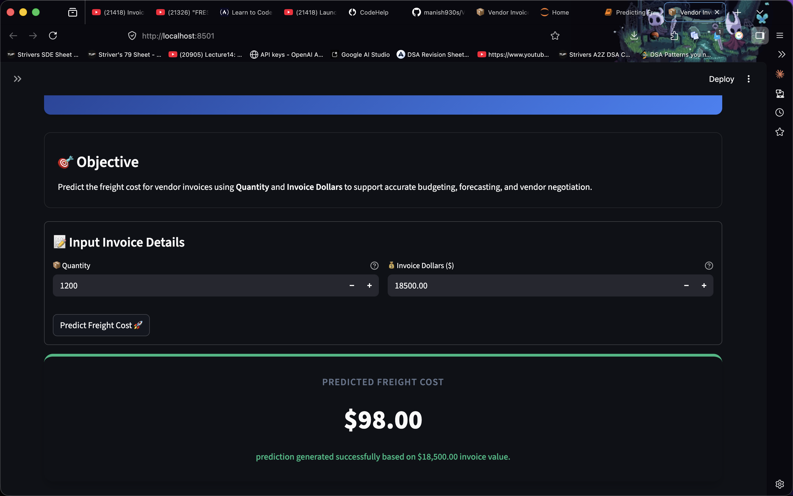
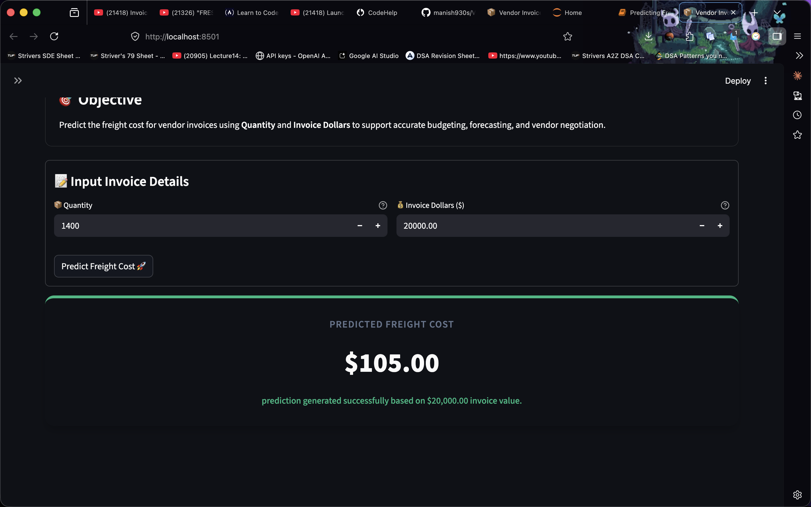
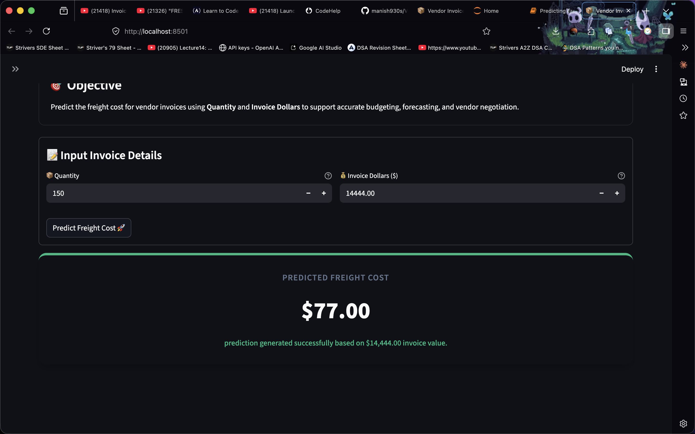

# 📦 Vendor Invoice Intelligence



> AI-powered platform for **Freight Cost Prediction** and **Invoice Risk Flagging** — built with Python, scikit-learn, and Streamlit.

---

## 🚀 Live Demo

```bash
streamlit run app.py
```

---

## 🎯 Problem Statement

Manual invoice review is slow, error-prone, and expensive. This project automates two critical workflows:

- 🚛 **Freight Cost Prediction** — predict shipping costs from invoice value
- 🚨 **Invoice Risk Flagging** — detect abnormal invoices that need manual approval

---

## 🏗️ Project Structure
minor_project_6/

├── app.py                          # Streamlit web app

├── data/

│   └── inventory.db                # SQLite database

├── inferencing/

│   ├── predict_freight.py          # Freight cost inference

│   └── predict_invoice_flag.py     # Invoice flag inference

├── invoice_flagging/

│   ├── data_preprocessing.py       # Data loading & labeling

│   ├── modeling_evaluation.py      # Model training & evaluation

│   └── train.py                    # Training entry point

├── notebooks/

│   ├── Predicting Freight Cost.ipynb

│   ├── invoice flagging.ipynb

│   └── freight_cost_prediction/    # Modular freight pipeline

├── models/                         # Saved model artifacts (.pkl)

└── images/                         # Screenshots & assets

---

## 🧠 ML Models

### 🚛 Freight Cost Prediction

| Model | Features | Metric |
|---|---|---|
| Linear Regression | `Dollars` | MAE, RMSE, R² |

### 📋 Invoice Risk Flagging

| Model | Features | Metric |
|---|---|---|
| Random Forest (Tuned) | `invoice_dollars`, `total_item_dollars`, `Freight`, `avg_receiving_delay`, ... | F1 Score |

**Labeling Logic:**

- Invoice vs purchase dollar mismatch > $5 → 🚨 Flagged
- Average receiving delay > 10 days → 🚨 Flagged

---

## ⚙️ Setup

**1. Clone the repo**

```bash
git clone https://github.com/your-username/minor_project_6.git
cd minor_project_6
```

**2. Create virtual environment**

```bash
python3 -m venv .venv
source .venv/bin/activate
```

**3. Install dependencies**

```bash
pip install pandas scikit-learn streamlit plotly joblib jupyter
```

**4. Train the models**

```bash
# Freight model — run notebook
jupyter notebook notebooks/Predicting\ Freight\ Cost.ipynb

# Invoice flagging model
cd invoice_flagging
python train.py
```

**5. Run the app**

```bash
streamlit run app.py
```

---

## 📊 App Screenshots





---

## 🗄️ Database Schema

Data sourced from `inventory.db` (SQLite):

- `vendor_invoice` — invoice records (quantity, dollars, freight, dates)
- `purchases` — purchase order records (brand, quantity, dollars, receiving dates)

---

## 📌 Notes

- `models/*.pkl` and `data/*.db` are excluded from version control via `.gitignore`
- All paths are resolved relative to file location using `pathlib.Path`

---

## 👤 Author

**Pranab** — B.Tech CSE | Minor Project 6

---

> ⭐ Star this repo if you found it useful!
